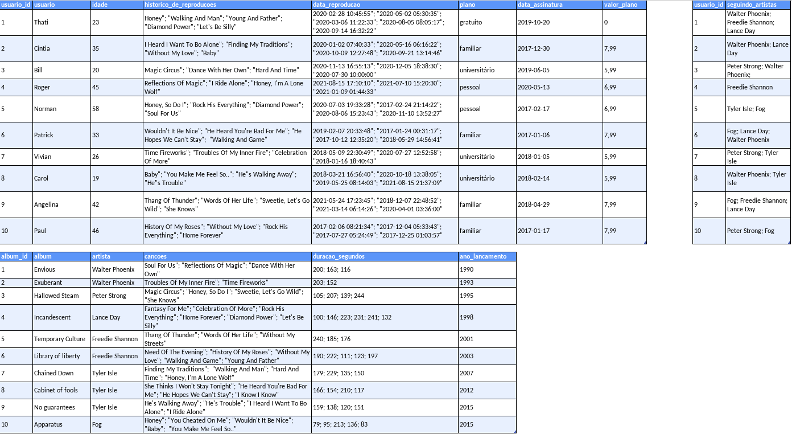
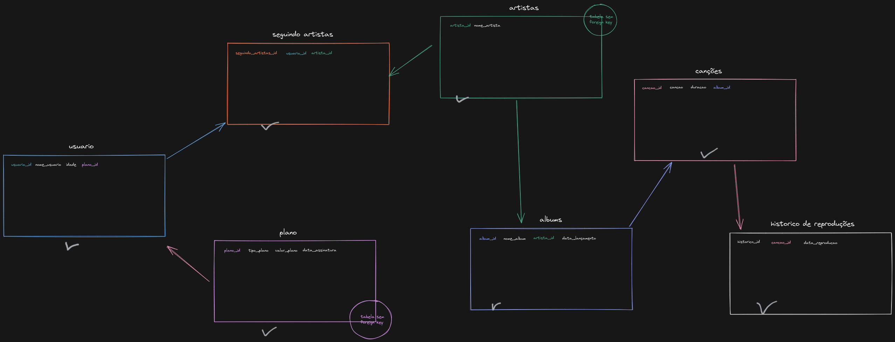

# One For All

Projeto feito de forma individual durante o curso da [Trybe](https://www.betrybe.com/) com o objetivo de normalizar, criar e realizar queries em um banco de dados

## 🔧 Funções

- Criar um banco de dados normalizado
- Aplicabilidade de JOINS para realizar queries

## ⭐ Habilidades

- Normalizar um banco de dados a partir de uma planilha do excel.
- Aplicar a 1ª regra de normalização
- Aplicar a 2ª regra de normalização
- Aplicar a 3ª regra de normalização

## 💻 Como iniciar

1. Faça o clone do projeto
2. Entre no MySQL Workbench
3. Inicialize o banco de dados do arquivo `desafio1.sql`

## 📋 Tabelas não normalizadas

## Mentalizando a normalização

## Feito Com:

### Contato

Copyright © 2021 Michael Caxias

